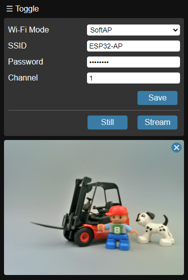

# ESP32 Camera Demo

A simplified Arduino ESP32 camera demo. Offers viewing of still photos and video streams, along with network configuration functionality.

Based on [arduino-esp32 version 2.0.11](https://github.com/espressif/arduino-esp32/releases/tag/2.0.11).

## Usage Instructions

1. The firmware starts in Wi-Fi SoftAP mode by default. Use your phone to scan for Wi-Fi networks, locate and connect to the network starting with "Node-".
2. Open a web browser on your phone, enter and access: 192.168.4.1
3. On the webpage, you can view videos or modify network settings.

## Snapshot
